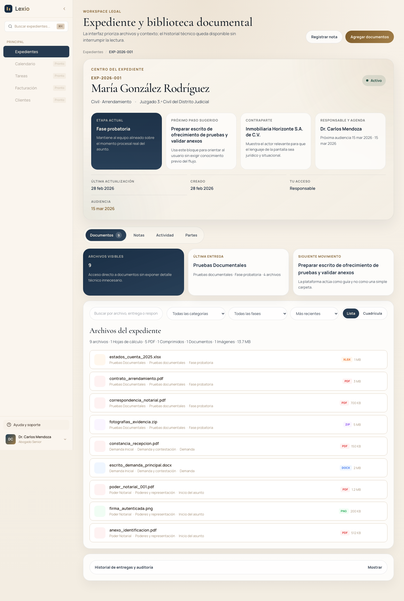

# Lexio Web Workspace Guide

This guide shows the legal workspace as it appears in the running SSR application seeded with the local demo dataset.

## What you are looking at

1. **Navigation shell**
   The left rail keeps global navigation, case search, support access, and session controls in one stable location.

2. **Workspace header**
   The top band identifies the page as a legal case workspace, not a generic file browser. Primary actions stay visible without displacing case context.

3. **Case center card**
   The central summary groups the client, case type, court, current phase, next action, responsible lawyer, and hearing date into a single high-value scan block.

4. **Context tabs**
   `Documentos`, `Notas`, `Actividad`, and `Partes` divide the workspace into operational context instead of mixing all information into one column.

5. **Document filters and list**
   Search, category, phase, sort, and density controls sit directly above the file list so the user can refine the visible evidence set without leaving the page.

6. **Delivery and audit access**
   The collapsed delivery history area keeps delivery-level audit detail available without competing with the primary file-reading path.

## Reading order

For first-time users, this is the intended scan path:

1. confirm the case and current phase
2. identify the next suggested action
3. review visible files and their legal grouping
4. move into notes, activity, or parties only when deeper context is needed
5. open delivery history when audit detail matters

## Notes about this image

- Captured from the real SSR build, not a static mock.
- Uses the seeded local dataset.
- Actual timestamps, authors, and document counts will vary after local edits or E2E runs.
